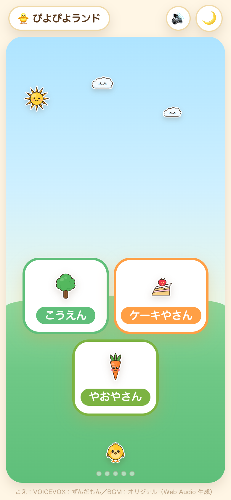

# ぴよぴよランド 🐥

4〜5歳の姪っ子のための、**⭐で そだつ まち**（ランチャー／ポータル）。
スマホのホーム画面にこの1つのURLを追加すれば、開くだけで街が広がり、3つのゲームを選べます。



**公開URL: https://kerokero-1245.github.io/**

## 世界観の正典（必読）

このページは「子ども版どうぶつの森」的な、⭐で育つ街「ぴよぴよランド」です。
世界観・ぴよ・街の育ち方・⭐しきい値表・localStorageキー台帳・演出・禁止事項の
**単一の情報源（正典）**は [`docs/WORLD.md`](docs/WORLD.md) です。実装は必ずこれに従います。
数値・キー・文言を変えるときは、**WORLD.md と `index.html` を同時に**更新します。

## このページの役割（街MVP）

ビルド不要の静的ページです。画面の CSS と街の JS は `index.html` 1枚にインラインで書き、
素材は同じリポジトリに同梱しています（シールポップSVG は `assets/img/`、BGM のエンジンと曲は
`assets/bgm/engine.js`・`assets/bgm/songs.js`、タイトルの声は `assets/voice/piyopiyo-land.m4a`）。
**外部CDN・外部送信はゼロ**、保存は **localStorage**（タイトル読み上げ済みの印 `land.titleVoicePlayed` だけは sessionStorage）。GitHub Pages のユーザーサイトとして、
`main` ブランチ直下の `index.html` がそのままルートURLで即配信されます（Actions不要）。

- **1枚の風景**（空・地面）の中に、3つの大きな施設カードと飾りスロットを配置
  （縦持ち・背の低い画面は 2＋1、横長は 3枚よこ並び。巨大タップ領域を保ち、被り・はみ出しなし）
- 相棒 **🐥ぴよ** が画面内に常駐。タップで跳ねて一言、⭐が一番少ない施設をたまに控えめに指す
- 🌙ボタンで **夜モード**（空が夜に→ぴよが「またあしたね」→タップ or 再訪問で朝に戻る）
- 縦持ちスマホ最優先。横持ち・タブレット・PC でも崩れない
- 見た目は3つのアプリと統一（クリーム背景・オレンジ・グリーン・角丸・やわらかい影）
- **初回タップ**で「ぴよぴよランド」を1回よみあげ（1セッション1回。ブラウザの自動再生制限に合わせ
  ユーザー操作起点）。同梱クリップ `assets/voice/piyopiyo-land.m4a` を `Audio()` で再生し、
  無ければ端末の音声合成（speechSynthesis／日本語）→ 無音、の順に**多段フォールバック**（絶対に落ちない）

### 街の燃料（fuel）と発展

街は3つのアプリで貯めた⭐を**そのまま読んで**（バックエンド無し）確定的に育ちます。

```
fuel = Number(localStorage['meiro.totalStars']  || 0)
     + Number(localStorage['sansu.totalStars']  || 0)
     + Number(localStorage['kotoba.totalStars'] || 0)
```

キーが無い・壊れた値でも**必ず安全に 0 として**描画します（NaN・負値も 0 扱い）。
⭐しきい値に応じて **10段階**（最初は⭐2で最初の変化、後半ほど間隔が広がる）で
飾り・住人が増えます。前回訪問より育っていたら、ぴよが跳ねて「わー ふえた！」と祝福。
**⭐は減らず・段階は巻き戻らない**（退行禁止）。段階表の正典は WORLD.md §3.4。

### localStorage キー

- **読むだけ**（他アプリ所有・改変禁止）: `meiro.totalStars` / `sansu.totalStars` / `sansu.starsResetAt` / `kotoba.totalStars` / `kotoba.starsResetAt`
- **街が書く**（`land.` プレフィックスのみ）:
  `land.reachedStage`（到達済み最大段階・単調増加。育った演出の判定にも使う）/ `land.lastSeenStars`（前回fuelの控え）
  / `land.lastNightDate`（🌙にした日付）/ `land.lastPointed`（ぴよが前回指した施設 park/cake/shop）/ `land.bgm`（BGM ON/OFF）
  / `land.titleVoicePlayed`（**sessionStorage**・タイトル読み上げ済みフラグ）

台帳の正典は WORLD.md §7。

## 3つのアプリへのリンク（巨大導線・URLは不変）

| 施設 | アプリ | 内容 | URL |
| --- | --- | --- | --- |
| 🌳 こうえん | おつかいめいろ | めいろでプログラミング的思考の下地 | https://kerokero-1245.github.io/otsukai-meiro/ |
| 🍰 ケーキやさん | ぴよぴよさんすう | キャラの増減で たしざん・ひきざん | https://kerokero-1245.github.io/piyopiyo-sansu/ |
| 🥕 やおやさん | ぴよぴよことば | ベルトコンベアで ことば・語彙あそび | https://kerokero-1245.github.io/piyopiyo-kotoba/ |

施設名は世界観に合わせて表示していますが、**リンク先URLは従来どおり**です。
「家族に配るURLは https://kerokero-1245.github.io/ の1つだけ」の約束を守ります。

## 姪っ子への配布手順

1. このURLをLINEで送る → **https://kerokero-1245.github.io/**
2. スマホでリンクを開く
3. ブラウザの共有メニューから「**ホーム画面に追加**」
4. 追加された 🐥 の「ぴよぴよランド」を開くと、街が広がります

## 見た目・進行のカスタマイズ

- 配色は `index.html` の `:root` の CSS変数（`--bg` / `--orange` / `--green` など）。
  既存3アプリ（`otsukai-meiro` / `piyopiyo-sansu` / `piyopiyo-kotoba` の `theme.ts`）に合わせています。
- ⭐しきい値・段階の飾りは `index.html` 内の `THRESHOLDS` / `DECOS`、ぴよのセリフは `SAY_*`。
  **必ず WORLD.md の表と一字一句そろえて**変更してください。

## 音声（タイトルよみあげ）

- 初回タップで「ぴよぴよランド」を1回だけよみあげます。実装は `index.html` の
  `playTitleVoice()`（クリップ `Audio()` 再生 → speechSynthesis → 無音の多段フォールバック）。
- 同梱クリップ: `assets/voice/piyopiyo-land.m4a`（**VOICEVOX ENGINE**・話者 **ずんだもん／あまあま**
  〈style id 1〉・`speedScale` 0.92・24kHz→AAC 64kbps mono `m4a`）。他の3アプリと同じ声で統一。
- 差し替え時はファイル名を `piyopiyo-land.m4a` のまま `assets/voice/` に置くだけ（コード変更不要）。

## BGM（オルゴール・ループ）

- やわらかい**オルゴール風の子守唄**（`land`・C メジャーペンタ・66BPM・16小節シームレスループ）を
  **Web Audio でその場生成**します（録音物・外部素材ゼロ・完全オフライン）。**初期状態は ON・控えめ音量**。
- 実装は同梱の共通エンジン `assets/bgm/engine.js`（`window.PiyoBgm`）＋スコア `assets/bgm/songs.js`
  （`window.PIYO_SONGS` の `land` 1曲。基盤は素材リポジトリ `piyo-assets/bgm/`）。声・効果音と**同じ
  AudioContext を共有**します。
- **最初のタップで再生開始**（ブラウザの自動再生制限に合わせユーザー操作起点）。タイトルよみあげ・
  声の再生中は**ダッキング**（音量を下げ、終了で戻す）。**🌙夜モードで約2秒フェードアウト**し、
  朝に戻ると再開します。
- **ON/OFF はトップバーの 🔊/🔇 チップ**（`localStorage` キー `land.bgm`・既定ON・OFFは即停止で永続）。
  AudioContext 非対応・スクリプト未読込でも**無害**（BGMだけ鳴らず、他機能は通常どおり）。

## クレジット

- 音声合成: **VOICEVOX:ずんだもん**（[VOICEVOX](https://voicevox.hiroshiba.jp/) 利用規約に基づく）。
- **BGM: オリジナル（Web Audio 生成）**。録音物・外部素材は使っていません。
- いずれもページ最下部にも小さく表示しています。